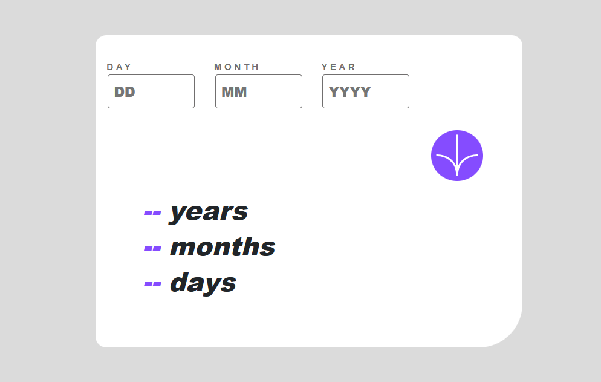

This is a solution to the [Age calculator app challenge on Frontend Mentor](https://www.frontendmentor.io/challenges/age-calculator-app-dF9DFFpj-Q). Frontend Mentor challenges help you improve your coding skills by building realistic projects. 

Users should be able to:

- View an age in years, months, and days after submitting a valid date through the form
- Receive validation errors if:
  - Any field is empty when the form is submitted
  - The day number is not between 1-31
  - The month number is not between 1-12
  - The year is in the future
  - The date is invalid e.g. 31/04/1991 (there are 30 days in April)
- View the optimal layout for the interface depending on their device's screen size
- See hover and focus states for all interactive elements on the page
- **Bonus**: See the age numbers animate to their final number when the form is submitted

- Live Site URL: [Add live site URL here](https://ageinfo.netlify.app/)

### Built with
- Semantic HTML5 markup
- CSS custom properties
- Bootstrap5
- Mobile-first workflow

## Author

- Website - [Add your name here](https://gentledove.netlify.app)
- Frontend Mentor - [@yourusername](https://www.frontendmentor.io/profile/etimexo)
- Twitter - [@yourusername](https://www.twitter.com/teo-teoso)

## Acknowledgments

I'm really grateful for the creators of ChatGPT. It explained some concepts for me and helped in shortening my code to some extent. Though I'm not familiar with them all yet, I'll keep learning as much I can so as to get better and better.

